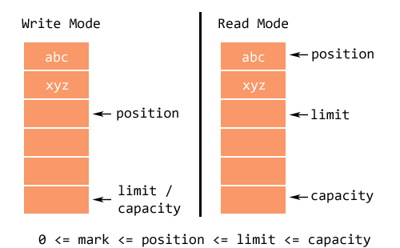

#学习笔记

## BIO、NIO、AIO 笔记
> 参考：[Java IO 编程（BIO、NIO、AIO完整实例代码）](http://blog.anxpp.com/index.php/archives/895/)
### BIO
#### 一.简介
1. BIO模型：采用BIO通信模型的服务端，通常由一个独立的Acceptor线程负责监听客户端的连接，它接收到客户端连接请求之后为每个客户端创建一个新的线程进行链路处理没处理完成后，通过输出流返回应答给客户端，线程销毁。即典型的一请求一应答通宵模型。
2. 原理及过程： 服务端提供IP和监听端口，客户端通过连接操作想服务端监听的地址发起连接请求，通过三次握手连接，如果连接成功建立，双方就可以通过套接字进行通信。 传统的同步阻塞模型开发中，ServerSocket负责绑定IP地址，启动监听端口；Socket负责发起连接操作。连接成功后，双方通过输入和输出流进行同步阻塞式通信。 
3. 传统BIO通信模型图：
> 
#### 二.实现源码：详细见study/io/bio

### 伪异步（优化后的BIO）
#### 一.简介
1. 在BIO的基础上，优化处理客户端的线程，使用线程池来管理这些线程，实现1个或多个线程处理N个客户端的模型（但是底层还是使用的同步阻塞I/O），通常被称为“伪异步I/O模型“。
2. 伪异步I/O模型图：
> 
#### 二.实现源码：详细见study/io/bio2

### NIO
#### 一.简介
1. JDK 1.4中的java.nio.*包中引入新的Java I/O库，其目的是提高速度。实际上，“旧”的I/O包已经使用NIO重新实现过，即使我们不显式的使用NIO编程，也能从中受益。
2. NIO我们一般认为是New I/O（也是官方的叫法），因为它是相对于老的I/O类库新增的，做了很大的改变。但民间跟多人称之为Non-block I/O，即非阻塞I/O，因为这样叫，更能体现它的特点。
3. NIO提供了与传统BIO模型中的Socket和ServerSocket相对应的SocketChannel和ServerSocketChannel两种不同的套接字通道实现。
4. 新增的着两种通道都支持阻塞和非阻塞两种模式。

> 阻塞模式使用就像传统中的支持一样，比较简单，但是性能和可靠性都不好；非阻塞模式正好与之相反。对于低负载、低并发的应用程序，可以使用同步阻塞I/O来提升开发速率和更好的维护性；对于高负载、高并发的（网络）应用，应使用NIO的非阻塞模式来开发。

5. NIO模型图：
> 

#### 二.缓冲区 Buffer
1. Buffer是一个对象，包含一些要写入或者读出的数据。
2. 在NIO库中，所有数据都是用缓冲区处理的。在读取数据时，它是直接读到缓冲区中的；在写入数据时，也是写入到缓冲区中。任何时候访问NIO中的数据，都是通过缓冲区进行操作。
3. 缓冲区实际上是一个数组，并提供了对数据结构化访问以及维护读写位置等信息。
4. 具体的缓存区有这些：ByteBuffe、CharBuffer、 ShortBuffer、IntBuffer、LongBuffer、FloatBuffer、DoubleBuffer。他们实现了相同的接口：Buffer。

#### 三.通道 Channel
1. 对数据的读取和写入要通过Channel，它就像水管一样，是一个通道。通道不同于流的地方就是通道是双向的，可以用于读、写和同时读写操作。
2. 底层的操作系统的通道一般都是全双工的，所以全双工的Channel比流能更好的映射底层操作系统的API。
3. Channel主要分两大类：SelectableChannel 用户网络读写、FileChannel 用于文件操作

#### 四.多路复用器 Selector
1. Selector是Java NIO 编程的基础。
2. Selector提供选择已经就绪的任务的能力：Selector会不断轮询注册在其上的Channel，如果某个Channel上面发生读或者写事件，这个Channel就处于就绪状态，会被Selector轮询出来，然后通过SelectionKey可以获取就绪Channel的集合，进行后续的I/O操作。
3. 一个Selector可以同时轮询多个Channel，因为JDK使用了epoll()代替传统的select实现，所以没有最大连接句柄1024/2048的限制。所以，只需要一个线程负责Selector的轮询，就可以接入成千上万的客户端。

#### 五.实现源码：详细见study/io/nio

### AIO
#### 一.简介
1. NIO 2.0引入了新的异步通道的概念，并提供了异步文件通道和异步套接字通道的实现。
2. 异步的套接字通道是真正的异步非阻塞I/O，对应于UNIX网络编程中的事件驱动I/O（AIO）。他不需要过多的Selector对注册的通道进行轮询即可实现异步读写，从而简化了NIO的编程模型。

#### 二.实现源码：详细见study/io/aio

### 各种I/O对比
> 


## Buffer 笔记
> 参考：JDK文档、[Java NIO 的前生今世 之三 NIO Buffer 详解](https://segmentfault.com/a/1190000006824155)
#### 一.简介
1. Buffer 其实就是一块内存区域, 我们可以在这个内存区域中进行数据的读写. NIO Buffer 其实是这样的内存块的一个封装, 并提供了一些操作方法让我们能够方便地进行数据的读写。
2. Buffer 类型有：ByteBuffer, CharBuffer, DoubleBuffer, FloatBuffer, IntBuffer, LongBuffer, ShortBuffer。
3. 多个当前线程使用缓冲区是不安全的。
4. 标记、位置、限制和容量值遵守以下不变式：0 <= 标记 <= 位置 <= 限制 <= 容量 

#### 二.基本使用
1. 将数据写入到 Buffer 中
2. 调用 Buffer.flip()方法, 将 NIO Buffer 转换为读模式
3. 从 Buffer 中读取数据
4. 调用 Buffer.clear() 或 Buffer.compact()方法, 将 Buffer 转换为写模式
```
IntBuffer intBuffer = IntBuffer.allocate(2);
intBuffer.put(1234);
intBuffer.put(5678);
intBuffer.flip();
System.out.println(intBuffer.get()); // 每当调用一次 get 方法读取数据时, buffer 的读指针都会向前移动一个单位长度(在这里是一个 int 长度)
System.out.println(intBuffer.get());
```

#### 三.Buffer 属性
> Buffer 有三个属性：capacity（容量）、position（位置）、limit（限制），其中 position 和 limit 的含义与 Buffer 处于读模式或写模式有关, 而 capacity 的含义与 Buffer 所处的模式无关。

1. capacity：一个内存块会有一个固定的大小
2. position：写数据时，从一个确定位置（position）开始写入，最初 position 为0，每写一个单位，position 递增1；读数据时（调用了 filp()方法，写模式转换为读模式，position 自动被设置为0），每读取一个单位的数据，position 递增1
3. limit：写模式时，limit 等于 capacity；读模式时，limit 等于写数据时的 position 。limit - position 表示此时还可以写入/读取多少单位的数据
> 
```
IntBuffer intBuffer = IntBuffer.allocate(10);
intBuffer.put(10);
intBuffer.put(101);
System.out.println("Write mode: ");
System.out.println("\tCapacity: " + intBuffer.capacity());
System.out.println("\tPosition: " + intBuffer.position());
System.out.println("\tLimit: " + intBuffer.limit());
// 转换为写模式
intBuffer.flip();
System.out.println("Read mode: ");
System.out.println("\tCapacity: " + intBuffer.capacity());
System.out.println("\tPosition: " + intBuffer.position());
System.out.println("\tLimit: " + intBuffer.limit());
// 执行结果
Write mode: 
    Capacity: 10
	Position: 2
	Limit: 10
Read mode: 
	Capacity: 10
	Position: 0
	Limit: 2
```

#### 四.常用方法
1. 分配 Buffer：每个类型的 Buffer 都有一个 allocate()方法, 可以通过这个方法分配 Buffer
```
ByteBuffer buf = ByteBuffer.allocate(48); // 分配了48 * sizeof(Byte)字节的内存空间
CharBuffer buf2 = CharBuffer.allocate(1024); // 分配了1024 * sizeof(char) 即 1024*2 字节的内存空间，因为一个char占2字节
```
2. 写入数据到 Buffer
```
int bytesRead = inChannel.read(buf); // read into buffer.
buf.put(127);
```
3. 从 Buffer 中读取数据
```
int bytesWritten = inChannel.write(buf); // read from buffer into channel.
byte aByte = buf.get();
```
4. 重置 position，Buffer.rewind()方法可以重置 position 的值为0, 因此可以重新读取/写入 Buffer 了。如果是读模式, 则重置的是读模式的 position, 如果是写模式, 则重置的是写模式的 position
```
IntBuffer intBuffer = IntBuffer.allocate(2);
intBuffer.put(1);
intBuffer.put(2);
System.out.println("position: " + intBuffer.position()); // 2
intBuffer.rewind(); // 重置
System.out.println("position: " + intBuffer.position()); // 0
intBuffer.put(1);
intBuffer.put(2);
System.out.println("position: " + intBuffer.position()); // 2
intBuffer.flip();// 将写模式切换为读模式
System.out.println("position: " + intBuffer.position()); // 0
intBuffer.get();
intBuffer.get();
System.out.println("position: " + intBuffer.position()); // 2
intBuffer.rewind(); // 重置
System.out.println("position: " + intBuffer.position()); // 0
```
5. mark()和 reset()：可以通过调用 Buffer.mark()将当前的 position 的值保存起来, 随后可以通过调用 Buffer.reset()方法将 position 的值回复回来
```
IntBuffer intBuffer = IntBuffer.allocate(2);
intBuffer.put(1);
intBuffer.put(2);
intBuffer.flip();// 写模式切换为读模式
System.out.println(intBuffer.get()); // 1
System.out.println("position: " + intBuffer.position()); // 1
intBuffer.mark(); // 标记
System.out.println(intBuffer.get()); // 2
System.out.println("position: " + intBuffer.position()); // 2
intBuffer.reset(); // 重置到标记处
System.out.println("position: " + intBuffer.position()); // 1
System.out.println(intBuffer.get()); // 2
```
6. flip, rewind 和 clear 的区别：flip，当从写模式变为读模式时, 原先的 写 position 就变成了读模式的 limit；rewind, 即倒带, 这个方法仅仅是将 position 置为0；clear 将 positin 设置为0, 将 limit 设置为 capacity，
```
public final Buffer flip() {
    limit = position;
    position = 0;
    mark = -1;
    return this;
}
public final Buffer rewind() {
    position = 0;
    mark = -1;
    return this;
}
public final Buffer clear() {
    position = 0;
    limit = capacity;
    mark = -1;
    return this;
}
```
7. Buffer 的比较
> 可以通过 equals() 或 compareTo() 方法比较两个 Buffer, 当且仅当如下条件满足时, 两个 Buffer 是相等的：(1)两个 Buffer 是相同类型的(2)两个 Buffer 的剩余的数据个数是相同的(3)两个 Buffer 的剩余的数据都是相同的。注意：比较两个 Buffer 时, 并不是 Buffer 中的每个元素都进行比较, 而是比较 Buffer 中剩余的元素。

## lombok 笔记
> 参考：[lombok注解介绍](http://blog.csdn.net/sunsfan/article/details/53542374)
#### 一.简介
> lombok 提供了简单的注解的形式来帮助我们简化消除一些必须有但显得很臃肿的 java 代码。

#### 二.常用注解
1. @Data：注解在类上；提供类所有属性的 getting 和 setting 方法，此外还提供了equals、canEqual、hashCode、toString 方法
2. @Setter：注解在属性上；为属性提供 setting 方法
3. @Getter：注解在属性上；为属性提供 getting 方法
4. @Log4j：注解在类上；为类提供一个 属性名为 log 的 log4j 日志对象
5. @NoArgsConstructor：注解在类上；为类提供一个无参的构造方法
6. @RequiredArgsConstructor：注解在类上；使用类中所有带有@NonNull注解的或者带有final修饰的成员变量生成对应的构造方法
7. @AllArgsConstructor：注解在类上；为类提供一个全参的构造方法
8. @NonNull：注解在属性上（和 @Setter 上）或注解在参数上；非空检查，如果为空，抛出 NullPointerException
9. @Cleanup：注解在变量上；保证此变量代表的资源会被自动关闭，默认是调用资源的close()方法（如果是其它方法，使用@Cleanup(“methodName”)来指定要调用的方法）
10. @ToString：注解在类上；生成 toString 方法，可以使用 of、exclude 来指定变量和排除变量
11. @EqualsAndHashCode：注解在类上；生成 equals 方法和 hashCode 方法，可以使用 of、exclude 来指定变量和排除变量
12. @SneakyThrows：注解在方法上；将方法中的代码用try-catch语句包裹起来，捕获异常并在catch中用Lombok.sneakyThrow(e)把异常抛出，可以使用@SneakyThrows(Exception.class)的形式指定抛出哪种异常
13. @Synchronized：注解在方法上；效果和synchronized关键字相同，区别在于锁对象不同，对于类方法和实例方法，synchronized关键字的锁对象分别是类的class对象和this对象，而@Synchronized得锁对象分别是私有静态final对象LOCK和私有final对象lock，当然，也可以自己指定锁对象
14. @Log：注解在类上；为类提供一个 属性名为 log 的 util 日志对象


## AQS 笔记
> 参考：
[Java并发包源码学习之AQS框架（一）概述](http://www.cnblogs.com/zhanjindong/p/java-concurrent-package-aqs-overview.html)
[java并发-独占锁与共享锁](http://blog.csdn.net/wojiushiwo945you/article/details/42292999)

#### 一.简介
> AQS 即 java.util.concurrent.locks.AbstractQueuedSynchronizer 类，它是 java.util.concurrent 的核心之一。
如 ReentrantLock、Semaphore、CountDownLatch 都有一个内部类 Sync，而 Sync 就继承自 AbstractQueuedSynchronizer。

#### 二.核心
1. 通过一个**共享变量**来同步状态，变量的状态由**子类**去维护
2. **共享变量**的**修改**都是通过**Unsafe类**提供的**CAS操作**完成的
3. AQS 负责：(1)**线程阻塞队列**的维护；(2)线程的**阻塞**和**唤醒**（自旋和睡眠/唤醒）
4. AbstractQueuedSynchronizer类的主要方法是**acquire**和**release**，典型的**模板方法**， 下面这4个方法由**子类实现**：
```
 protected boolean tryAcquire(int arg) // 尝试获得独占锁（排它锁）
 protected boolean tryRelease(int arg) // 尝试是否独占锁（排它锁）
 protected int tryAcquireShared(int arg) // 尝试获得共享锁
 protected boolean tryReleaseShared(int arg) // 尝试释放共享锁
```
> acquire方法用来**获取锁**，返回true说明线程获取成功继续执行，一旦返回false则线程加入到等待队列中，等待被唤醒，release方法用来**释放锁**。 
一般来说实现的时候这两个方法被封装为lock和unlock方法，如：study.aqs.SimpleLock

#### 三.线程阻塞队列
1. AbstractQueuedSynchronizer 是通过一个内部类Node来实现CLH lock queue的一个变种
2. CLH lock queue其实就是一个**FIFO的队列**，队列中的**每个结点（线程）只要等待其前继释放锁就可以了**，如：study.aqs.ClhSpinLock

> ClhSpinLock的Node类实现很简单只有一个布尔值，AbstractQueuedSynchronizer$Node的实现稍微复杂点。大概：

> 

> head（头指针）、tail（尾指针）、prev（指向前继的指针）、next（图中没有画出来，它跟prev相反，指向后继），
关键不同就是next指针，这是因为AQS中线程不是一直在自旋的，而可能会反复的睡眠和唤醒，这就需要前继释放锁的时候通过next 指针找到其后继将其唤醒，
也就是AQS的等待队列中后继是被前继唤醒的。AQS结合了自旋和睡眠/唤醒两种方法的优点。


