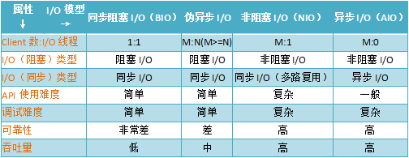

#学习笔记

## BIO、NIO、AIO 笔记
> 参考：[Java IO 编程（BIO、NIO、AIO完整实例代码）](http://blog.anxpp.com/index.php/archives/895/)
### BIO
#### 一.简介
1. BIO模型：采用BIO通信模型的服务端，通常由一个独立的Acceptor线程负责监听客户端的连接，它接收到客户端连接请求之后为每个客户端创建一个新的线程进行链路处理没处理完成后，通过输出流返回应答给客户端，线程销毁。即典型的一请求一应答通宵模型。
2. 原理及过程： 服务端提供IP和监听端口，客户端通过连接操作想服务端监听的地址发起连接请求，通过三次握手连接，如果连接成功建立，双方就可以通过套接字进行通信。 传统的同步阻塞模型开发中，ServerSocket负责绑定IP地址，启动监听端口；Socket负责发起连接操作。连接成功后，双方通过输入和输出流进行同步阻塞式通信。 
3. 传统BIO通信模型图：
> 
#### 二.实现源码：详细见study/io/bio

### 伪异步（优化后的BIO）
#### 一.简介
1. 在BIO的基础上，优化处理客户端的线程，使用线程池来管理这些线程，实现1个或多个线程处理N个客户端的模型（但是底层还是使用的同步阻塞I/O），通常被称为“伪异步I/O模型“。
2. 伪异步I/O模型图：
> 
#### 二.实现源码：详细见study/io/bio2

### NIO
#### 一.简介
1. JDK 1.4中的java.nio.*包中引入新的Java I/O库，其目的是提高速度。实际上，“旧”的I/O包已经使用NIO重新实现过，即使我们不显式的使用NIO编程，也能从中受益。
2. NIO我们一般认为是New I/O（也是官方的叫法），因为它是相对于老的I/O类库新增的，做了很大的改变。但民间跟多人称之为Non-block I/O，即非阻塞I/O，因为这样叫，更能体现它的特点。
3. NIO提供了与传统BIO模型中的Socket和ServerSocket相对应的SocketChannel和ServerSocketChannel两种不同的套接字通道实现。
4. 新增的着两种通道都支持阻塞和非阻塞两种模式。

> 阻塞模式使用就像传统中的支持一样，比较简单，但是性能和可靠性都不好；非阻塞模式正好与之相反。对于低负载、低并发的应用程序，可以使用同步阻塞I/O来提升开发速率和更好的维护性；对于高负载、高并发的（网络）应用，应使用NIO的非阻塞模式来开发。

5. NIO模型图：
> 

#### 二.缓冲区 Buffer
1. Buffer是一个对象，包含一些要写入或者读出的数据。
2. 在NIO库中，所有数据都是用缓冲区处理的。在读取数据时，它是直接读到缓冲区中的；在写入数据时，也是写入到缓冲区中。任何时候访问NIO中的数据，都是通过缓冲区进行操作。
3. 缓冲区实际上是一个数组，并提供了对数据结构化访问以及维护读写位置等信息。
4. 具体的缓存区有这些：ByteBuffe、CharBuffer、 ShortBuffer、IntBuffer、LongBuffer、FloatBuffer、DoubleBuffer。他们实现了相同的接口：Buffer。

#### 三.通道 Channel
1. 对数据的读取和写入要通过Channel，它就像水管一样，是一个通道。通道不同于流的地方就是通道是双向的，可以用于读、写和同时读写操作。
2. 底层的操作系统的通道一般都是全双工的，所以全双工的Channel比流能更好的映射底层操作系统的API。
3. Channel主要分两大类：SelectableChannel 用户网络读写、FileChannel 用于文件操作

#### 四.多路复用器 Selector
1. Selector是Java NIO 编程的基础。
2. Selector提供选择已经就绪的任务的能力：Selector会不断轮询注册在其上的Channel，如果某个Channel上面发生读或者写事件，这个Channel就处于就绪状态，会被Selector轮询出来，然后通过SelectionKey可以获取就绪Channel的集合，进行后续的I/O操作。
3. 一个Selector可以同时轮询多个Channel，因为JDK使用了epoll()代替传统的select实现，所以没有最大连接句柄1024/2048的限制。所以，只需要一个线程负责Selector的轮询，就可以接入成千上万的客户端。

#### 五.实现源码：详细见study/io/nio

### AIO
#### 一.简介
1. NIO 2.0引入了新的异步通道的概念，并提供了异步文件通道和异步套接字通道的实现。
2. 异步的套接字通道是真正的异步非阻塞I/O，对应于UNIX网络编程中的事件驱动I/O（AIO）。他不需要过多的Selector对注册的通道进行轮询即可实现异步读写，从而简化了NIO的编程模型。

#### 二.实现源码：详细见study/io/aio

### 各种I/O对比
> 

## lombok 笔记
> 参考：[lombok注解介绍](http://blog.csdn.net/sunsfan/article/details/53542374)
#### 一.简介
> lombok 提供了简单的注解的形式来帮助我们简化消除一些必须有但显得很臃肿的 java 代码。

#### 二.常用注解
1. @Data：注解在类上；提供类所有属性的 getting 和 setting 方法，此外还提供了equals、canEqual、hashCode、toString 方法
2. @Setter：注解在属性上；为属性提供 setting 方法
3. @Getter：注解在属性上；为属性提供 getting 方法
4. @Log4j：注解在类上；为类提供一个 属性名为 log 的 log4j 日志对象
5. @NoArgsConstructor：注解在类上；为类提供一个无参的构造方法
6. @RequiredArgsConstructor：注解在类上；使用类中所有带有@NonNull注解的或者带有final修饰的成员变量生成对应的构造方法
7. @AllArgsConstructor：注解在类上；为类提供一个全参的构造方法
8. @NonNull：注解在属性上（和 @Setter 上）或注解在参数上；非空检查，如果为空，抛出 NullPointerException
9. @Cleanup：注解在变量上；保证此变量代表的资源会被自动关闭，默认是调用资源的close()方法（如果是其它方法，使用@Cleanup(“methodName”)来指定要调用的方法）
10. @ToString：注解在类上；生成 toString 方法，可以使用 of、exclude 来指定变量和排除变量
11. @EqualsAndHashCode：注解在类上；生成 equals 方法和 hashCode 方法，可以使用 of、exclude 来指定变量和排除变量
12. @SneakyThrows：注解在方法上；将方法中的代码用try-catch语句包裹起来，捕获异常并在catch中用Lombok.sneakyThrow(e)把异常抛出，可以使用@SneakyThrows(Exception.class)的形式指定抛出哪种异常
13. @Synchronized：注解在方法上；效果和synchronized关键字相同，区别在于锁对象不同，对于类方法和实例方法，synchronized关键字的锁对象分别是类的class对象和this对象，而@Synchronized得锁对象分别是私有静态final对象LOCK和私有final对象lock，当然，也可以自己指定锁对象
14. @Log：注解在类上；为类提供一个 属性名为 log 的 util 日志对象

